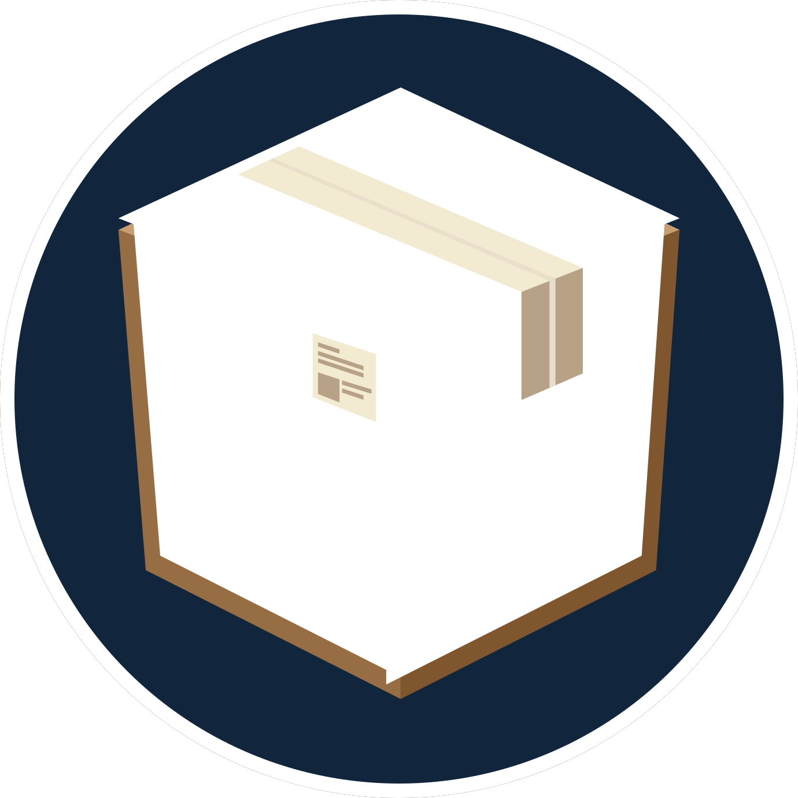

# Packages

Library of lua/roblox utility modules

---

## Installation
Dropdown the `code` button at the top of the repository and hit `Download Zip`

**or**

sync packages using [wally](https://github.com/UpliftGames/wally)

<!-- TODO: add dependencies list -->